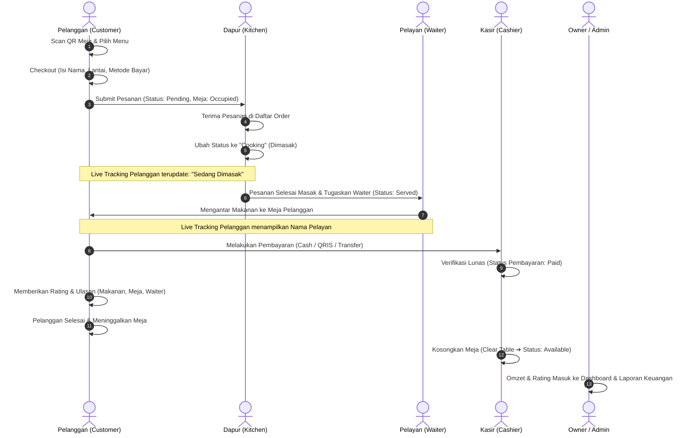

# PANDUAN ALUR PENGGUNAAN SISTEM (STANDARD OPERATING PROCEDURE)
## Sistem Informasi Pemesanan Menu Berbasis Web QR Code
**Studi Kasus:** Little Palembang Cafe  
**Versi Sistem:** 2.0 (Multi-Role Architecture & Real-Time Tracking)

---

## 1. PENDAHULUAN & RINGKASAN PERAN (ROLES)

Sistem ini dirancang untuk mendigitalkan seluruh proses transaksi pemesanan di Little Palembang Cafe. Terdapat **5 (lima) peran/aktor** yang berinteraksi langsung dengan sistem:

| Peran (Role) | Jenis Akses | Halaman Utama | Wewenang & Fungsi Utama |
|---|---|---|---|
| **1. Pelanggan (*Customer*)** | Publik / Tanpa Login (Scan QR Meja) | `/order/{uuid}` | Memilih menu, memesan makanan/minuman, live tracking status pesanan, cetak struk, dan memberikan rating/ulasan. |
| **2. Dapur (*Kitchen*)** | Login Karyawan (`role: dapur`) | `/admin/orders` | Memantau antrean pesanan masuk, mengubah status masak (*Pending ➔ Cooking ➔ Served ➔ Completed*), dan menugaskan nama pelayan (*waiter*). |
| **3. Kasir (*Cashier*)** | Login Karyawan (`role: kasir`) | `/admin/orders` | Menerima & memverifikasi pembayaran pelanggan (*Unpaid ➔ Paid*), memantau status keterisian meja, dan mengosongkan meja (*Clear Table*). |
| **4. Owner (*Pemilik*)** | Login Pimpinan (`role: owner`) | `/admin/dashboard` | Memantau omzet penjualan (Harian, Mingguan, Bulanan, Tahunan), grafik performa, statistik kepuasan pelanggan, *leaderboard* pelayan, dan cetak laporan keuangan. |
| **5. Admin (*Administrator*)** | Login Superuser (`role: admin`) | `/admin/dashboard` | Memiliki akses penuh (*Full Access*): kelola master menu, manajemen meja & unduh QR code, metode pembayaran, manajemen akun staf, dan kontrol seluruh pesanan. |

---

## 2. ALUR PENGGUNAAN BERDASARKAN MASING-MASING PERAN

### A. ALUR PENGGUNAAN: PELANGGAN (*CUSTOMER / GUEST*)

Pelanggan menggunakan sistem secara mandiri tanpa perlu membuat akun (*guest session*) berbasis QR Code fisik yang tertempel di meja kafe.

```
[Scan QR Meja] ➔ [Pilih Menu & Keranjang] ➔ [Checkout & Isi Data] ➔ [Pesan Sekarang] ➔ [Live Tracking Status] ➔ [Bayar & Beri Rating]
```

#### Langkah-Langkah Operasional Pelanggan:
1. **Memindai QR Code Meja (*Scan Barcode*)**:
   - Pelanggan duduk di meja dan memindai QR Code di meja menggunakan kamera smartphone atau aplikasi pemindai QR.
   - Browser smartphone membuka halaman katalog menu sesuai meja pelanggan (contoh: URL `/order/{uuid}`).
2. **Melihat Informasi Meja & Katalog Menu**:
   - Pelanggan melihat nomor meja, statistik rating meja, dan badge meja favorit.
   - Pelanggan dapat memfilter menu berdasarkan kategori (*Makanan, Minuman, Cemilan, dll.*) serta mencari nama menu.
   - Menu yang berstatus **Stok Habis / Tidak Tersedia** akan menampilkan badge non-aktif dan tombol tambah akan terkunci otomatis.
3. **Memilih Menu & Mengelola Keranjang Belanja (*Cart*)**:
   - Pelanggan menekan tombol **Tambah (+)** pada menu yang diinginkan.
   - Pelanggan dapat mengatur jumlah kuantitas (*quantity*) secara live.
   - Sistem menampilkan *floating cart badge* yang berisi rekap jumlah item dan total harga sementara.
4. **Halaman Checkout**:
   - Pelanggan menekan tombol keranjang / checkout untuk masuk ke `/order/{uuid}/checkout`.
   - Pelanggan mengisi formulir pemesanan:
     - **Nama Pemesan** (*Customer Name*)
     - **Pilihan Posisi Lantai** (*Lantai 1* atau *Lantai 2*)
     - **Metode Pembayaran** (*Cash / Tunai, QRIS, atau Transfer Bank*)
5. **Membuat Pesanan (*Place Order*)**:
   - Pelanggan menekan tombol **"Pesan Sekarang"**.
   - Sistem memvalidasi ketersediaan menu dan membuat nomor order baru:
     - Status pesanan awal tercatat: `order_status: pending`, `payment_status: pending`.
     - Status meja otomatis berubah menjadi **Occupied (Terisi)**.
     - *Catatan:* Jika di meja tersebut sudah ada pesanan sebelumnya yang masih aktif, sistem otomatis menggabungkan item baru ke dalam pesanan meja tersebut (*Add to existing order*).
6. **Live Tracking Status Pesanan (`/order/{uuid}/status/{order}`)**:
   - Pelanggan diarahkan ke halaman status pemesanan interaktif dengan polling real-time tanpa perlu me-refresh browser.
   - Pelanggan dapat memantau 4 tahapan status:
     1. **Pesanan Diterima (*Pending*)**: Menunggu antrean dapur.
     2. **Sedang Dimasak (*Cooking*)**: Dapur sedang menyiapkan makanan/minuman.
     3. **Disajikan (*Served*)**: Makanan sedang diantar oleh Pelayan (nama pelayan akan muncul di layar).
     4. **Selesai (*Completed*)**: Pesanan telah selesai disajikan.
   - Pelanggan dapat menekan tombol **"Cetak Struk"** untuk melihat/mencetak nota rincian pesanan.
7. **Proses Pembayaran**:
   - Jika memilih **Cash**: Pelanggan menuju kasir untuk membayar tunai.
   - Jika memilih **QRIS / Transfer Bank**: Pelanggan melihat detail rekening / scan barcode QRIS kafe yang tersedia di halaman pembayaran.
8. **Memberikan Rating & Ulasan (*Review*)**:
   - Pada halaman status, pelanggan dapat mengisi formulir ulasan:
     - Memberikan rating bintang (1-5) untuk **Makanan**.
     - Memberikan rating bintang (1-5) untuk kenyamanan **Meja**.
     - Memberikan rating bintang (1-5) untuk pelayanan **Pelayan (*Waiter*)**.
     - Menandai centang meja sebagai **Meja Favorit**.
     - Menuliskan kritik/saran komentar teks untuk makanan dan pelayan.
   - Menekan tombol **"Kirim Ulasan"** untuk menyimpan ulasan.

---

### B. ALUR PENGGUNAAN: DAPUR (*KITCHEN STAFF*)

Peran Dapur bertanggung jawab penuh atas antrean pesanan makanan/minuman dan memperbarui status pengerjaan secara real-time.

```
[Login Dapur] ➔ [Buka Daftar Antrean] ➔ [Mulai Masak (Cooking)] ➔ [Pilih Pelayan & Sajikan (Served)] ➔ [Selesaikan Pesanan]
```

#### Langkah-Langkah Operasional Dapur:
1. **Login Staf Dapur**:
   - Buka `/login`, masukkan email (`dapur@gmail.com`) dan password.
   - Sistem langsung mengarahkan (*auto-redirect*) staf dapur ke halaman antrean pesanan (`/admin/orders`).
2. **Memantau Pesanan Baru Masuk**:
   - Dapur melihat daftar antrean pesanan yang diurutkan berdasarkan waktu pemesanan terbaru.
   - Setiap kartu pesanan menampilkan nomor meja, posisi lantai (Lantai 1 / Lantai 2), nama pelanggan, rincian menu, kuantitas, dan catatan pesanan.
3. **Memulai Proses Masak (*Pending ➔ Cooking*)**:
   - Saat koki mulai memasak menu pesanan, klik tombol **"Mulai Masak"** atau ubah status ke **`Cooking`**.
   - Status di smartphone pelanggan seketika berubah menjadi *"Sedang Dimasak"*.
4. **Menyajikan Pesanan & Menugaskan Pelayan (*Cooking ➔ Served*)**:
   - Setelah makanan/minuman selesai dimasak dan siap diantar, staf dapur memilih nama pelayan yang bertugas mengantar dari daftar *waiter* yang tersedia.
   - Klik tombol **"Siap Saji"** atau ubah status ke **`Served`**.
   - Nama pelayan yang mengantar (*waiter name*) otomatis tercatat di sistem dan tampil di layar live tracking pelanggan.
5. **Menyelesaikan atau Membatalkan Pesanan**:
   - Setelah makanan sampai ke meja pelanggan, status dapat diubah menjadi **`Completed`**.
   - *Opsi Darurat:* Jika stok bahan baku habis mendadak, staf dapur/admin dapat memilih status **`Cancelled`** (sistem otomatis membatalkan status pembayaran dan mengosongkan status meja).

---

### C. ALUR PENGGUNAAN: KASIR (*CASHIER STAFF*)

Peran Kasir bertugas mengelola pembayaran transaksi, memvalidasi bukti bayar, dan mengontrol ketersediaan meja fisik kafe.

```
[Login Kasir] ➔ [Terima Pembayaran] ➔ [Verifikasi Lunas (Paid)] ➔ [Monitoring Meja] ➔ [Kosongkan Meja (Clear Table)]
```

#### Langkah-Langkah Operasional Kasir:
1. **Login Staf Kasir**:
   - Buka `/login`, masukkan email (`kasir@gmail.com`) dan password.
   - Sistem mengarahkan kasir langsung ke halaman antrean transaksi (`/admin/orders`).
2. **Menerima Pembayaran Pelanggan**:
   - Kasir melayani pelanggan yang membayar tunai di meja kasir, atau mengecek mutasi pembayaran QRIS/Transfer Bank.
3. **Verifikasi Pembayaran (*Pending ➔ Paid*)**:
   - Kasir mencari nomor meja / nama pelanggan terkait pada daftar pesanan.
   - Klik tombol hijau **"Verifikasi Lunas"** (`orders.verifyPayment`).
   - Status pembayaran pesanan seketika berubah dari `pending/unpaid` menjadi **`Paid` (Lunas)**.
4. **Monitoring Status Keterisian Meja (`/admin/tables`)**:
   - Kasir membuka menu **Status Meja** untuk memantau kondisi seluruh meja di kafe:
     - **Merah / Occupied**: Meja sedang terisi pelanggan aktif.
     - **Hijau / Available**: Meja kosong dan siap menerima tamu baru.
5. **Mengosongkan Meja (*Clear Table*)**:
   - Setelah pelanggan selesai makan, membayar lunas, dan meninggalkan meja:
   - Kasir menekan tombol **"Kosongkan Meja"** (*Clear Table*).
   - Sistem otomatis menandai semua pesanan aktif di meja tersebut menjadi `completed` dan mengubah status meja kembali menjadi **Available (Tersedia)**.

---

### D. ALUR PENGGUNAAN: OWNER (*PEMILIK KAFE*)

Peran Owner berfokus pada analisis bisnis, pemantauan omzet finansial, evaluasi kinerja staf, dan pengawasan kualitas layanan pelanggan.

```
[Login Owner] ➔ [Pantau Dashboard Finansial] ➔ [Analisis Rating & Leaderboard Waiter] ➔ [Cetak Laporan Keuangan]
```

#### Langkah-Langkah Operasional Owner:
1. **Login Owner**:
   - Buka `/login`, masukkan email (`owner@gmail.com`) dan password.
   - Sistem langsung mengarahkan owner ke **Dashboard Eksekutif** (`/admin/dashboard`).
2. **Monitoring Rekap Omzet & Statistik Transaksi**:
   - Owner memantau kartu ringkasan pendapatan:
     - **Omzet Hari Ini** (akumulasi transaksi *paid* per hari ini).
     - **Omzet Minggu Ini**.
     - **Omzet Bulan Ini**.
     - **Omzet Tahun Ini**.
     - Jumlah total pesanan selesai (*completed*) vs pesanan tertunda (*pending*).
3. **Analisis Kualitas Layanan & Ulasan Pelanggan**:
   - Meninjau nilai rata-rata kepuasan (skala 1-5) untuk:
     - **Rating Kualitas Makanan** (*Average Food Rating*).
     - **Rating Kenyamanan Meja** (*Average Table Rating*).
     - **Rating Pelayanan Waiter** (*Average Waiter Rating*).
   - Melihat **Top 3 Meja Terfavorit** pilihan pelanggan.
   - Melihat **Papan Peringkat Pelayan (*Waiters Performance Leaderboard*)** untuk mengetahui pelayan dengan rating tertinggi dan jumlah layanan terbanyak.
   - Membaca umpan balik, kritik, dan saran pelanggan secara langsung pada tabel review terbaru.
4. **Mencetak Laporan Penjualan (`/admin/reports`)**:
   - Owner membuka menu **Laporan Penjualan**.
   - Melihat rekap seluruh daftar transaksi yang telah lunas beserta rincian metode pembayaran dan tanggal transaksi.
   - Menekan tombol **"Cetak Laporan"** untuk mencetak rekap pembukuan secara rapi (*print-ready layout*).

---

### E. ALUR PENGGUNAAN: ADMIN (*ADMINISTRATOR SISTEM*)

Peran Admin memiliki hak akses tertinggi (*Superuser*) untuk mengelola seluruh master data, konfigurasi pembayaran, akun pengguna, dan seluruh operasional kafe.

```
[Login Admin] ➔ [Kelola Master Menu] ➔ [Generate QR Meja] ➔ [Kelola Akun Staf] ➔ [Kelola Payment Method] ➔ [Audit Pesanan]
```

#### Langkah-Langkah Operasional Admin:
1. **Login Administrator**:
   - Buka `/login`, masukkan kredensial Admin (`admin@gmail.com`).
   - Admin diarahkan ke Dashboard utama dengan menu navigasi lengkap.
2. **Manajemen Master Menu (`/admin/menus`)**:
   - **Tambah Menu Baru**: Klik *Tambah Menu*, isi Nama, Kategori (*Makanan/Minuman/Cemilan*), Sub-Kategori, Harga, Deskripsi, dan unggah Foto Menu.
   - **Edit Menu**: Mengubah harga, nama, deskripsi, atau mengganti gambar menu.
   - **Toggle Ketersediaan Stok (*Availability*)**: Menekan tombol switch untuk mengubah status menu menjadi *Tersedia* atau *Stok Habis* secara instan.
   - **Hapus Menu**: Menghapus menu dari database jika sudah tidak diproduksi.
3. **Manajemen Meja & QR Code Generator (`/admin/tables`)**:
   - **Tambah Meja**: Menambahkan nomor meja baru (sistem otomatis menghasilkan kode UUID unik).
   - **Generate & Unduh QR Code**: Sistem merender gambar QR Code beresolusi tinggi yang mengarah ke URL meja `/order/{uuid}`. Admin dapat mengunduh (*download*) atau mencetak QR Code untuk ditempel di meja fisik kafe.
   - **Hapus Meja**: Menghapus data meja (hanya diizinkan jika meja sedang dalam status *Available*).
4. **Manajemen Metode Pembayaran (`/admin/payment-methods`)**:
   - Menambahkan dan mengedit opsi pembayaran pelanggan:
     - **Cash / Tunai**
     - **QRIS** (dilengkapi fitur upload gambar barcode QRIS kafe)
     - **Transfer Bank** (isi nomor rekening bank, nama pemilik rekening, dan panduan transfer).
   - Mengatur status aktif/non-aktif metode pembayaran.
5. **Manajemen Pengguna / Karyawan (`/admin/users`)**:
   - Membuat akun baru untuk karyawan dengan menentukan peran (*Admin, Kasir, Dapur, Owner*).
   - Mengedit data profil, mengganti email, role, atau mereset password staf.
   - Menghapus akun karyawan (terdapat proteksi sistem agar admin tidak dapat menghapus akunnya sendiri).
6. **Kontrol Penuh Transaksi & Pesanan**:
   - Admin dapat menjalankan semua fungsi Dapur (update status masak, assign pelayan) dan Kasir (verifikasi pembayaran, kosongkan meja).
   - Admin memiliki wewenang khusus untuk **menghapus pesanan (*Delete Order*)** jika terjadi kesalahan input atau pembatalan fatal.

---

## 3. DIAGRAM ALUR INTEGRASI BISNIS END-TO-END

Berikut adalah matriks alur komunikasi data antar-peran dari saat pelanggan datang hingga meja kembali bersih:



---

## 4. KETENTUAN KHUSUS & OTOMASI SISTEM

1. **Isolasi Keranjang Belanja (*Session Isolation*)**:
   - Data keranjang belanja disimpan berbasis UUID meja (`cart_{uuid}`). Pelanggan di Meja 1 tidak akan pernah tercampur keranjangnya dengan Meja 2 meskipun membuka web secara bersamaan.
2. **Pemesanan Tambahan (*Additional Order*)**:
   - Jika pelanggan di meja yang sedang *Occupied* ingin memesan menu tambahan, sistem tidak membuat record meja baru, melainkan mengakumulasikan item baru ke pesanan aktif di meja tersebut dan memperbarui total tagihan secara otomatis.
3. **Proteksi Menu Habis (*Sold Out Guard*)**:
   - Menu yang di-nonaktifkan oleh admin tidak dapat ditambahkan ke keranjang belanja baik melalui antarmuka web maupun melalui request API (validasi backend 422).
4. **Auto-Complete saat Pengosongan Meja**:
   - Saat kasir menekan tombol *Clear Table*, semua pesanan aktif berstatus *pending/cooking/served* di meja tersebut otomatis ditandai *completed* sebelum meja diubah statusnya menjadi *available*.
5. **Keamanan Hak Akses (*Role Middleware & No-Cache*)**:
   - Seluruh rute dilindungi oleh middleware role. Dapur dan Kasir tidak dapat mengakses menu sensitif seperti Master Menu, Manajemen Pengguna, atau Pengaturan Pembayaran. Seluruh halaman admin dilindungi header `nocache` untuk mencegah data tersimpan di cache browser saat logout.

---
*Dokumen ini disusun berdasarkan implementasi teknis dan arsitektur kode aplikasi QR Web Cafe Little Palembang.*
